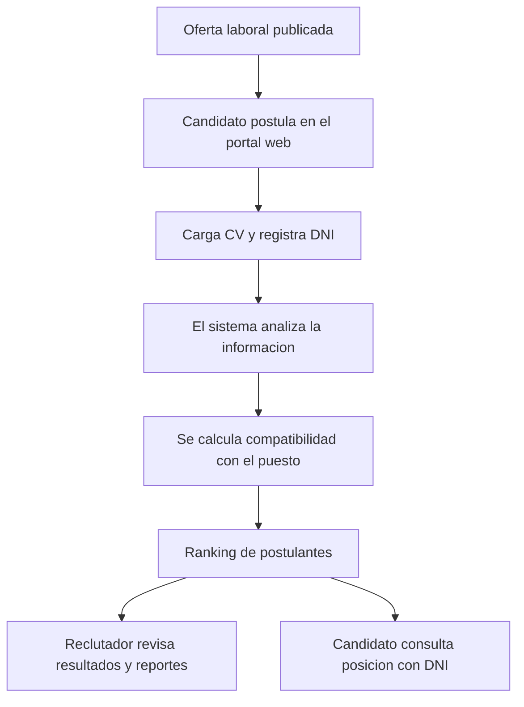

# TalentMatch AI

> Plataforma web inteligente para optimizar la gestion de postulantes, analizar CV y ordenar candidatos mediante un ranking explicable.

## Vision general

**TalentMatch AI** es un aplicativo web orientado a mejorar el proceso de seleccion de personal. Su objetivo es centralizar las ofertas laborales, recibir postulaciones digitales, analizar informacion curricular y generar un ranking de candidatos de forma mas ordenada, trazable y explicable.

La solucion combina un portal publico para candidatos con un panel interno para reclutadores y administradores. De esta manera, el proceso de postulacion no queda limitado a correos, archivos sueltos o evaluaciones manuales dispersas.

## Que problema resuelve

En muchos procesos de seleccion, la informacion de los postulantes se recibe de forma desordenada: CV por correo, datos incompletos, poca trazabilidad y evaluaciones dificiles de comparar.

TalentMatch AI propone una experiencia mas estructurada:

| Necesidad del proceso | Respuesta del aplicativo |
|---|---|
| Recibir postulaciones de forma ordenada | Portal publico para candidatos |
| Validar identidad basica del postulante | Registro mediante DNI |
| Revisar CV de distintos formatos | Carga de archivos PDF, DOCX y TXT |
| Comparar postulantes por puesto | Ranking de compatibilidad |
| Explicar la recomendacion | Resultado con criterios de evaluacion |
| Dar seguimiento al postulante | Consulta publica de ranking por DNI |
| Sustentar decisiones | Reportes, auditoria y exportacion CSV |

## Como funciona

## Modulos del sistema

### Portal del candidato

Permite que cualquier postulante revise ofertas activas y envie su postulacion sin necesidad de una cuenta interna.

Incluye:

- Visualizacion de puestos disponibles.
- Formulario de postulacion.
- Registro de DNI, datos personales y contacto.
- Carga de CV.
- Consentimiento para tratamiento de datos.
- Consulta de posicion en ranking mediante DNI.

### Panel de reclutador

Brinda una vista centralizada de los candidatos asociados a cada oferta laboral.

Incluye:

- Revision de postulantes registrados.
- Lectura de datos extraidos del CV.
- Visualizacion del ranking por puesto.
- Resultado de compatibilidad.
- Recomendacion inicial del sistema.
- Exportacion de informacion para analisis posterior.

### Panel de administrador

Permite gestionar la configuracion base del proceso de seleccion.

Incluye:

- Gestion de ofertas laborales.
- Revision general de candidatos.
- Acceso a reportes.
- Auditoria de actividad.
- Control interno del sistema.

## Ranking de postulantes

El ranking se genera a partir de la informacion registrada por el candidato y el contenido procesado desde su CV. El sistema evalua coincidencias con el puesto, tecnologias, experiencia y otros criterios definidos para la oferta.

El resultado no solo ordena candidatos: tambien ofrece una explicacion para facilitar una revision mas transparente por parte del reclutador.

| Elemento evaluado | Uso dentro del sistema |
|---|---|
| CV cargado | Extraccion de informacion relevante |
| Datos personales | Identificacion y trazabilidad |
| DNI | Consulta de ranking y control de duplicidad |
| Oferta seleccionada | Comparacion contra requisitos del puesto |
| Puntaje global | Posicion dentro del ranking |
| Recomendacion | Apoyo para la decision del reclutador |

## Consulta por DNI

Una de las funciones mas importantes del portal publico es permitir que el postulante consulte su avance sin acceder al panel interno.

Con su DNI, el candidato puede visualizar:

- Puesto al que postulo.
- Posicion actual en el ranking.
- Total de postulantes de la oferta.
- Puntaje obtenido.
- Recomendacion inicial del sistema.

Esta funcionalidad mejora la transparencia del proceso y reduce consultas manuales al equipo de reclutamiento.

## Roles de usuario

| Rol | Acceso principal | Finalidad |
|---|---|---|
| Candidato | Portal publico | Postular y consultar ranking por DNI |
| Reclutador | Panel interno | Evaluar postulantes y revisar ranking |
| Administrador | Panel interno | Gestionar ofertas, usuarios, reportes y auditoria |
| Auditor | Panel interno | Revisar trazabilidad del proceso |

## Experiencia visual

El aplicativo fue disenado con una interfaz limpia, profesional y responsive. Su estructura prioriza la lectura rapida de informacion, la separacion de roles y la navegacion directa entre postulacion, evaluacion y reportes.

Principios aplicados:

- Pantalla inicial clara para candidatos y usuarios internos.
- Acceso administrativo sin exponer credenciales demo.
- Formularios simples y guiados.
- Tablas de evaluacion faciles de revisar.
- Modo oscuro para una experiencia visual moderna.
- Diseno adaptable a escritorio y pantallas reducidas.

## Seguridad y privacidad

El sistema considera criterios basicos de privacidad para un entorno academico o piloto controlado:

- Las credenciales internas no se muestran en la pantalla publica.
- El candidato solo consulta su informacion mediante DNI.
- El panel administrativo esta separado del portal publico.
- La carga de CV se realiza desde formularios controlados.
- La informacion puede ser exportada para revision documentada.

Para un uso empresarial con datos reales, se recomienda fortalecer la solucion con base de datos administrada, cifrado de archivos, HTTPS obligatorio, politicas avanzadas de contrasena, copias de seguridad y revision legal de proteccion de datos personales.

## Alcance actual

TalentMatch AI se encuentra preparado como **producto funcional para demostracion, validacion academica y piloto controlado**.

Incluye:

- Backend funcional.
- Interfaz web responsive.
- Portal publico de postulacion.
- Registro de candidatos por DNI.
- Carga y procesamiento de CV.
- Gestion de ofertas laborales.
- Ranking de compatibilidad.
- Consulta publica de posicion.
- Panel interno para reclutamiento.
- Reportes, auditoria y exportacion CSV.

## Valor diferencial

TalentMatch AI no se limita a recibir CV. Su aporte esta en ordenar el proceso, reducir trabajo manual, dar mayor trazabilidad y ofrecer una evaluacion inicial explicable para apoyar la toma de decisiones en reclutamiento.

El sistema busca que candidatos y reclutadores interactuen dentro de un flujo mas claro, medible y profesional.
